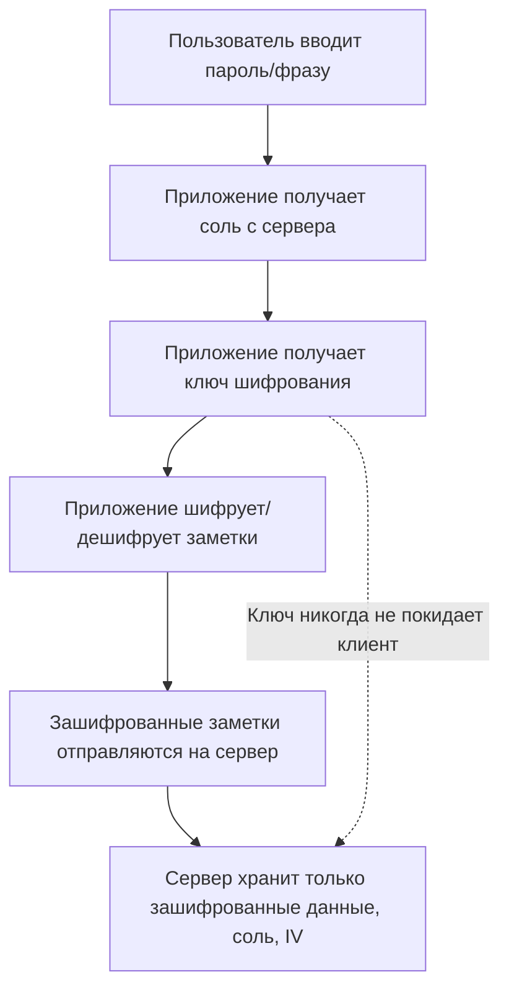
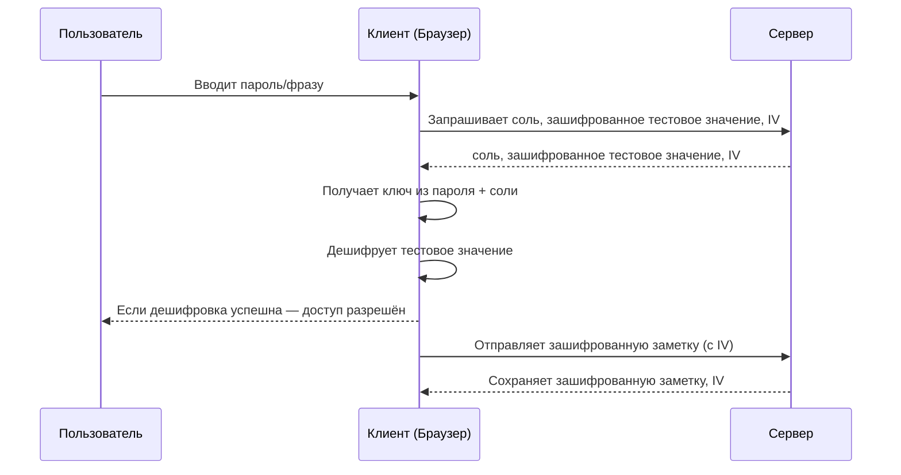

# Дизайн сквозного шифрования (E2EE) для заметок и саммари

## Обзор

Мы внедряем настоящее сквозное шифрование (E2EE) для пользовательских заметок и саммари. Это гарантирует, что **только пользователь** может читать свои данные — ни администраторы, ни сервер не могут расшифровать содержимое. Всё шифрование и дешифрование происходит на стороне клиента.

---

## Основные принципы

- **Получение ключа шифрования:** Ключ шифрования получается из пароля/фразы пользователя и уникальной соли (для каждого пользователя) с помощью надёжной функции получения ключа (PBKDF2, Argon2 и др.).
- **Криптография на клиенте:** Всё шифрование и дешифрование выполняется в браузере. Сервер никогда не видит пароль пользователя или ключ шифрования.
- **Данные на сервере:** На сервере хранятся только зашифрованные данные, соль и IV (инициализационный вектор).
- **Аутентификация:** Аутентификация пользователя (логин) реализуется отдельно от шифрования. Пароль для шифрования никогда не отправляется на сервер.

---

## Процесс получения ключа и шифрования

---

## Пользовательские сценарии

### 1. Регистрация

- Пользователь задаёт пароль/фразу.
- Приложение генерирует случайную соль.
- Приложение получает ключ шифрования из пароля + соли.
- Приложение шифрует известное "тестовое значение" (например, `"test"`) этим ключом.
- Приложение отправляет соль, зашифрованное тестовое значение и IV на сервер для хранения в профиле пользователя.

### 2. Вход и проверка пароля

- Пользователь вводит пароль/фразу.
- Приложение получает с сервера соль, зашифрованное тестовое значение и IV.
- Приложение получает ключ из введённого пароля + соли.
- Приложение пытается расшифровать тестовое значение:
  - Если дешифровка успешна и результат совпадает с оригиналом — пароль верный.
  - Если нет — пароль неверный.
- Ключ хранится в памяти только в течение сессии.

### 3. Шифрование/дешифрование заметок и саммари

- Для **шифрования**: Приложение использует полученный ключ для шифрования содержимого заметки/саммари перед отправкой на сервер. Для каждой заметки/саммари генерируется новый IV.
- Для **дешифрования**: Приложение получает зашифрованные данные и IV с сервера и расшифровывает их на клиенте.

### 4. Выход из аккаунта или закрытие вкладки

- Ключ шифрования и пароль удаляются из памяти.
- Для доступа к данным пользователь должен снова ввести пароль.

---

## Социальный вход (OAuth, Google и др.)

- Если пользователь не вводит пароль, после входа через соцсеть ему предлагается задать отдельную фразу для шифрования.
- Эта фраза используется для получения ключа E2EE, как и обычный пароль.

---

## AI-саммари и E2EE

- По умолчанию все заметки шифруются E2EE и никогда не покидают клиент в открытом виде.
- **Для генерации AI-саммари:**
  1. Заметка расшифровывается на клиенте.
  2. Открытый текст отправляется на сервер для саммаризации (с согласия пользователя).
  3. Сервер отправляет текст в OpenAI, получает саммари и возвращает его клиенту.
  4. Саммари шифруется на клиенте перед сохранением на сервере.
- **Согласие пользователя:** Пользователь информируется и должен дать согласие перед отправкой заметки на сервер/OpenAI для саммаризации.

---

## Работа с паролем/ключом

- Пароль **никогда не хранится** в постоянном хранилище (localStorage, cookies и др.), только в памяти на время сессии.
- Ключ получается в памяти и удаляется при выходе/закрытии вкладки.
- Если пользователь забывает пароль/фразу, данные восстановить невозможно (если не реализован механизм восстановления).

---

## Проверка пароля

- Сервер не может проверить пароль.
- Клиент проверяет пароль, пытаясь расшифровать сохранённое тестовое значение.

---

## Миграция для существующих пользователей

- Добавить поле `salt` в профиль пользователя.
- Для существующих пользователей при следующем входе предложить задать фразу для шифрования.
- Сохранить соль и зашифрованное тестовое значение в профиле.

---

## Сводная таблица

| Операция         | Кто видит открытый текст? | E2EE сохранено?   | Нужно согласие пользователя? |
| ---------------- | ------------------------- | ----------------- | ---------------------------- |
| Хранение заметки | Только пользователь       | Да                | Нет                          |
| AI-саммари       | Сервер/OpenAI             | Нет (для этой оп) | Да                           |

---

## Рекомендации по безопасности

- Никогда не хранить и не передавать пароль пользователя или полученный ключ.
- Использовать уникальные соли для каждого пользователя.
- Использовать надёжную функцию получения ключа (PBKDF2, Argon2 и др.).
- Для каждой операции шифрования использовать новый IV.
- Защищать приложение от XSS и других атак на клиенте.

---

## FAQ

**В: Как проверить правильность пароля?**  
О: Клиент пытается расшифровать известное тестовое значение, сохранённое в профиле пользователя. Если дешифровка успешна и результат совпадает с оригиналом — пароль верный.

**В: Как быть с социальным входом?**  
О: После входа через соцсеть предложить пользователю задать отдельную фразу для шифрования.

**В: Могут ли сервер или администраторы читать заметки пользователя?**  
О: Нет, только пользователь может расшифровать свои заметки.

**В: Как быть с AI-саммари?**  
О: Пользователь должен дать согласие на временную отправку заметки в открытом виде на сервер для саммаризации. Саммари затем шифруется перед сохранением.
